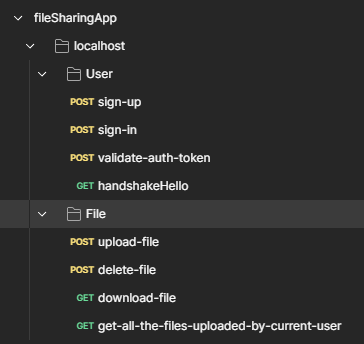

# File Sharing Application (Module #6, MERN Stack)


## Hosted Version of the Project:
[File Sharing Application](https://frontend-m6node-file-sharing-application.vercel.app/)

## FrontEnd GitHub Repository Link
[FrontEnd File Sharing Application](https://github.com/Alex21c/frontend-m6node-file-sharing-application)

## Overview:
In this project i have developed a robust and scalable file sharing application.

## Objectives: 
+ Understand the architecture and design principles of a file sharing application.
+ Learn to set up and configure backend servers for file storage and management.
+ Develop secure and efficient APIs for file upload, download, and sharing.
+ Implement user authentication and authorization mechanisms.
+ Ensure data security and integrity through encryption and access controls.
+ Optimize storage solutions and handle large volumes of data.
+ Troubleshoot common issues and ensure high availability of the application.

## Key features:
+ MVC Framework was used to built the application
+ MongoDB as backend Database 
+ ExpressJS for Server Implementation
+ NodeJS for BackEnd
+ ReactJS for FrontEnd

## .ENV file
```
PORT=4000
PRIVATE_KEY= any random key of yorus choice
MONGODB_CONNECTION_STRING= get it from previous readme file
USER_SESSION_EXPIRES_AFTER="2 days"
CLOUDINARY_CLOUD_NAME = GET YOURS FROM clodinary
CLOUDINARY_API_KEY= GET YOURS FROM clodinary
CLOUDINARY_API_SECRET=GET YOURS FROM clodinary
```
[Get yours cloundinary key](https://console.cloudinary.com/pm/c-3ef04f0f8bb3279d146a9fc27b88c8/getting-started)

## Postman API Endpoints file
[Postman API Endpoints.json](fileSharingApp.postman_collection.json)


## API End Points : User
### 1. Sign Up
Register a New User!
```
POST /api/v1/user/sign-up
```
#### REQUEST
```javascript
{
	email:  email address of user
	password: any random password
	firstName : first name of user
	lastName :  last name of user
}
```
#### RESPONSE
```javascript
{
    "success": true,
    "message": "User Account created successfully !",
    "auth-token": "JWT Auth Token"
}
```
### 2. Sign In
Validate User Sign In request!
```
POST /api/v1/user/sign-in
```
#### REQUEST
```javascript
{
 email:  email address of user
 password: password for sign-in
}
```
#### RESPONSE
```javascript
{
    "success": true,
    "message": "JWT Auth Token"
}

```

### 3. Validate Auth Token
Validate Auth Token!
```
POST /api/v1/user/validate-auth-token
```
#### REQUEST
```javascript
Headers
{ auth-token : JWT Auth Token as received after sign in or up}
```
#### RESPONSE
```javascript
{
    "isAuthTokenValid": true
}
```
### 4. Handshake
Perform handshake with server, useful for re-starting render free instance which has been spin off due to in activity.
```
GET /api/v1/user/handshake/hello
```
#### REQUEST
NA
#### RESPONSE
```javascript
{
    "success": true,
    "message": "hi there!"
}
```

## API End Points : File
### 1. Upload File
Upload the file to the server!
```
POST /api/v1/file/upload-file
```
#### REQUEST
```javascript
HEADERS
{
'auth-token' : "JWT Auth Token as provided earlier after sign-in or up"
}
BODY form-data
 fileName : file data (binary format)
```
#### RESPONSE
```javascript
{
    "success": true,
    "message": "File Uploaded Successfully !",
    "shareableLink": Shareable File URL Link
}

```

### 2. Delete File
Delete a previously Uploaded  file from the server!
```
POST /api/v1/file/delete-file
```
#### REQUEST
```javascript
HEADERS
{
'auth-token' : "JWT Auth Token as provided earlier after sign-in or up"
}
BODY JSON
{
    "fileUniqueID" :"mr8oh7ivi47i9tr1vcz5"
}
```
#### RESPONSE
```javascript
{
    "success": true,
    "message": "File deleted successfully!"
}

```

### 3. Download File
Download a file !
```
GET /api/v1/file/download-file/fileUniqueID
```
#### REQUEST
```javascript
HEADERS
{
'auth-token' : "JWT Auth Token as provided earlier after sign-in or up"
}
```
#### RESPONSE
```
Raw File whether Binary (images, docx etc. ) or text
```

### 2. Get all the files uploaded by current user
```
GET /api/v1/file/get-all-the-files-uploaded-by-current-user
```
#### REQUEST
```javascript
HEADERS
{
'auth-token' : "JWT Auth Token as provided earlier after sign-in or up"
}
```
#### RESPONSE
```
{
    "success": true,
    "data": [
        {
            "_id": "665c02aed92e69af44cf9909",
            "fileName": "investments.txt",
            "fileDownloadLink": "https://res.cloudinary.com/dwlfgbmsi/raw/upload/v1717306029/ynadn0mcmkfp81rl3med.txt",
            "fileUniqueID": "ynadn0mcmkfp81rl3med.txt",
            "fileTrackableShareableLink": "https://m6node-file-sharing-application.onrender.com/api/v1/file/download-file/ynadn0mcmkfp81rl3med.txt",
            "uploadedByWhichUser": "665c0125d92e69af44cf98fd",
            "traffic": 2,
            "createdAt": "2024-06-02T05:27:10.421Z",
            "updatedAt": "2024-06-02T05:28:02.485Z",
            "__v": 0
        }
        ...
        {
          nth file!
        }
    ]
}
```


## How to install and run in yours local machine
```bash
npm install
npm run start
```

## Tech. Stack Used:
+ [MongoDB](https://www.mongodb.com/) 
+ [ExpressJS](https://expressjs.com/) 
+ [ReactJS](https://react.dev/) 
+ [NodeJS](https://nodejs.org/en/) 

## Author
[Abhishek kumar](https://www.linkedin.com/in/alex21c/), ([Geekster](https://geekster.in/) MERN Stack FS-14 Batch)


